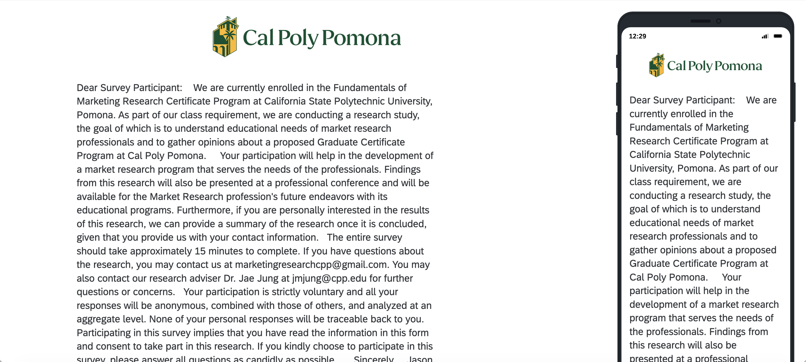
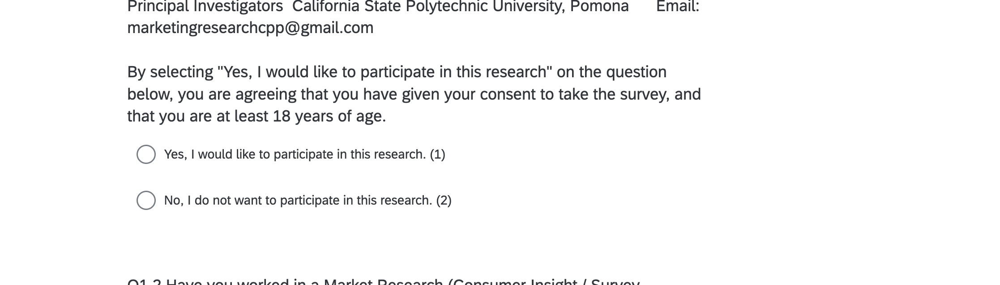

## Proof of Sharing with Instructor

Screenshot showing the Qualtrics survey shared with Jae Jung (jmjung):

## Rough Draft of Qualtrics Survey

### Beginning of Survey

### Middle of Survey

### Ending of Survey

## Appendix

- GitHub Repo: https://github.com/espinacecilia-design/6500
- GitHub Pages: [INSERT-PAGES-URL-HERE]