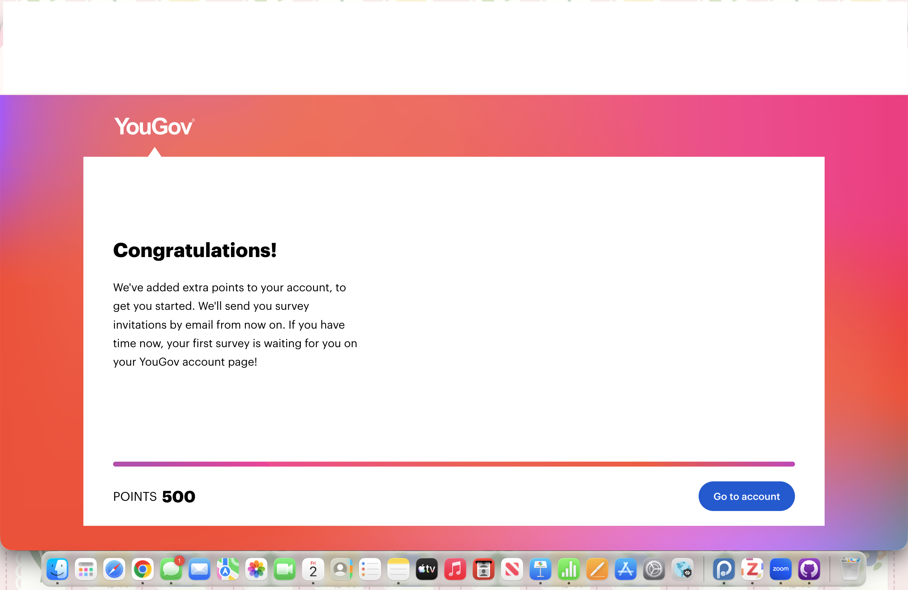
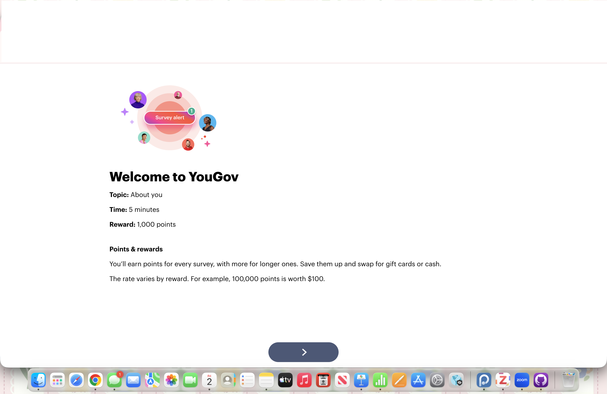
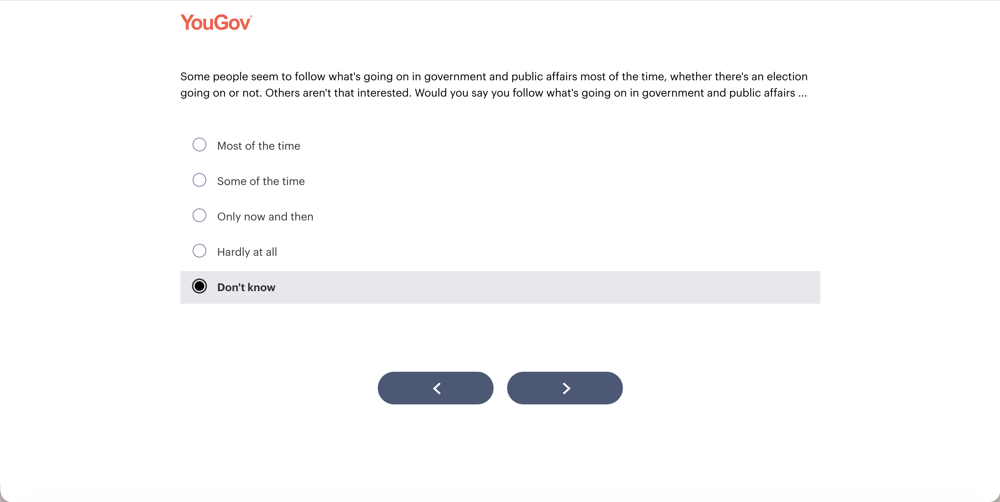
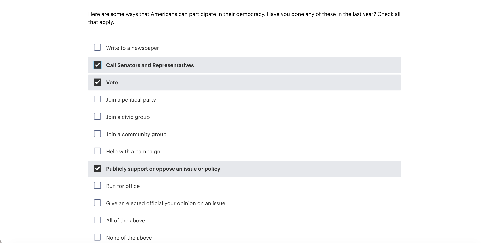
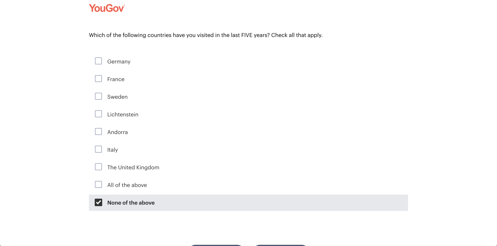
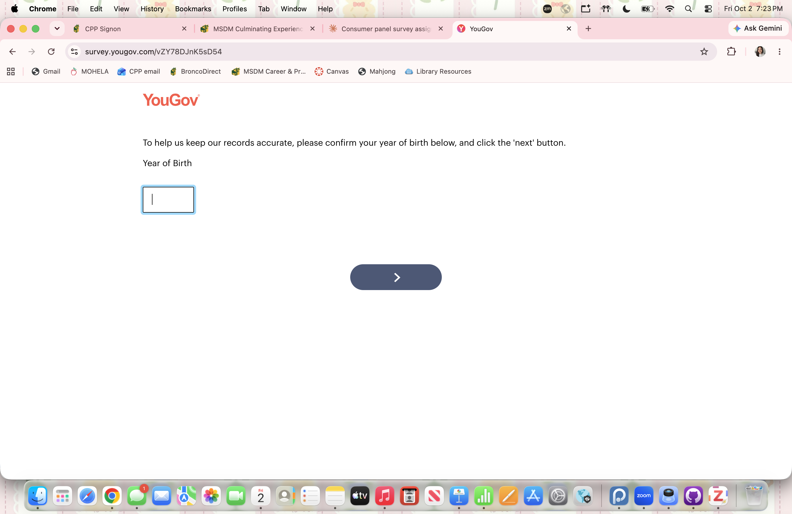

## 1. Overview

I joined YouGov on [GAP: date] and received 500 starter points on sign-up.

My first survey was a profile survey titled "Welcome to YouGov" (topic: About you, estimated time: 5 minutes, reward: 1,000 points).

[GAP: 1-2 sentences on how many surveys you were invited to or completed after this one.]

## 2. Questions I Found Weird or Confusing

### Question 1: Following government and public affairs

**What the question asked:** How often I follow what's going on in government and public affairs, with the options "Most of the time," "Some of the time," "Only now and then," "Hardly at all," and "Don't know."

**Why I chose it:**

- "Some of the time" and "Only now and then" sound almost the same, so the answer choices are not clearly distinct.
- "Government" and "public affairs" are two different topics bundled into one question.
- A "Don't know" option seems strange for a question about my own habits. I would know how often I follow the news, so this option fits knowledge questions better.
- The long lead-in ("Some people seem to follow... Others aren't that interested") appears designed to make low-interest answers feel acceptable, but it also makes the question wordy.

### Question 2: Ways to participate in democracy

**What the question asked:** Which of a list of civic activities I had done in the last year (check all that apply).

**Why I chose it:**

- The list includes both "All of the above" and "None of the above" next to the individual items. A respondent could check several items and "None of the above" at once, which contradicts itself.
- Several options overlap: "Join a civic group" vs. "Join a community group," and "Call Senators and Representatives" vs. "Give an elected official your opinion on an issue."
- "Publicly support or oppose an issue or policy" is very broad, so different people could interpret it very differently.
- "In the last year" is ambiguous (the past 12 months or the calendar year?).

### Question 3: Countries visited in the last five years

**What the question asked:** Which of seven European countries I had visited in the last five years (check all that apply).

**Why I chose it:**

- I could not tell why the survey was asking this. The list is all European and includes very small countries (Andorra, Liechtenstein) but no neighbors like Canada or Mexico, which seems odd for a US panel.
- "Lichtenstein" appears to be misspelled (the official spelling is "Liechtenstein"), which hurts the survey's credibility.
- "All of the above" in a country list is unnecessary.
- My guess is that it is a screening question or a check for people who claim to have visited everything, but the survey never explained why it was asking.

### Question 4: Year of birth confirmation

**What the question asked:** To "confirm" my year of birth in a blank text box.

**Why I chose it:**

- It says "confirm," but nothing is pre-filled, so I was really re-entering information I had already given when I signed up.
- It looks like a data-quality or consistency check, but the survey did not say so.
- There is no format hint (such as YYYY) in the free-text box.

### For contrast: a well-designed question

"Are you the parent or guardian of any children under the age of 18?" is short, answered with one yes/no choice, and has one clear meaning. The only thing I would add is a "Prefer not to say" option, since it is a personal question.

## 3. Lessons Learned for My Research Project

1. **Make answer choices distinct.** Overlapping options (Questions 1 and 2) make it hard for respondents to choose and make the data harder to interpret.
2. **Keep check-all lists clean.** Skip "All of the above," and make "None of the above" exclusive so it cannot be selected with other options.
3. **Ask about one concept at a time.** Combining "government and public affairs" (Question 1) made me unsure what to answer.
4. **Proofread everything.** A misspelled country name (Question 3) made me trust the survey a little less.
5. **Explain why you are asking.** Questions that seem unrelated or repeated (Questions 3 and 4) feel odd without context. A short note such as "we ask this to verify our records" would help.
6. **Define time frames and formats.** "In the last year" and an unformatted birth-year box leave room for different interpretations.
7. **Be transparent upfront.** YouGov showed the topic, length, and reward before I started, which I plan to do in my own survey.
8. [GAP: one lesson tied to your own research project topic.]

## Appendix

- GitHub repo: [GAP: link]
- GitHub Pages: [GAP: link]