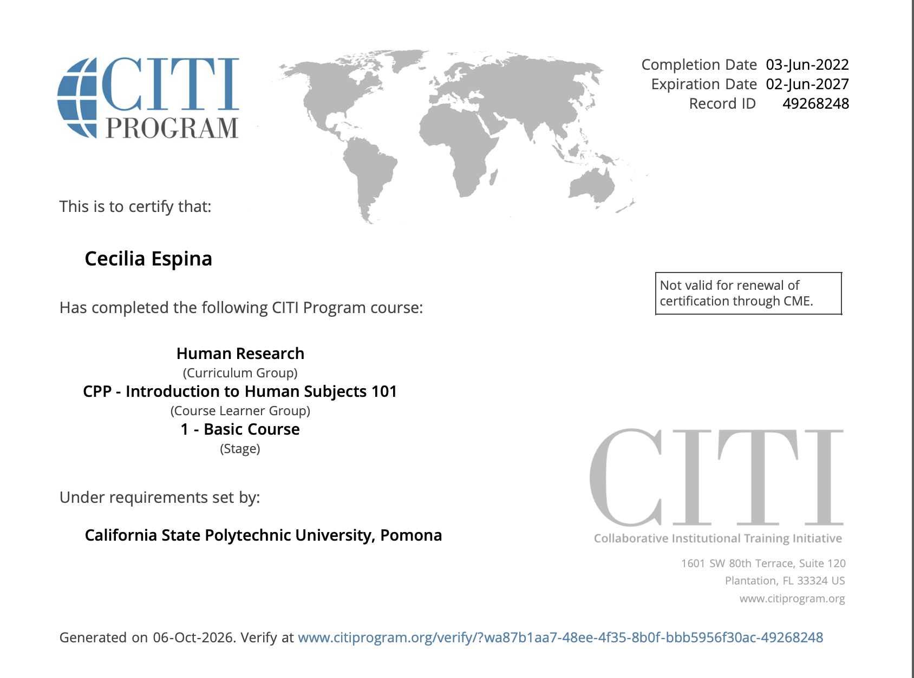

## Overview

For this assignment, I completed the CITI Program's **College of Business Administration** human subjects research training through Cal Poly Pomona. The training covers the CPP Introduction to Human Subjects 101 content, plus data collection in other countries and online. When working with human subjects, it's important to take privacy very serious as people are sharing their own experiences.

## Completion Summary

- **Course:** College of Business Administration (CITI Program)
- **Institution:** California State Polytechnic University, Pomona
- **Completion date:** June 3, 2022
- **Score:** 86%
- **Time spent:** 3 hours

## Certificate

{fig-alt="CITI completion certificate"}

## Appendix

- [CITI Program](https://www.citiprogram.org/)
- [CPP IRB Application Process](https://www.cpp.edu/research/research-compliance/irb/protocol.shtml)
- [CPP Required CITI Training](https://www.cpp.edu/research/research-compliance/rcr/hsr.shtml)
- [Certificate screenshot](citi_certificate.png)
- [GitHub repository]([YOUR REPO URL])
- [This report on GitHub Pages]([YOUR GITHUB PAGES URL])
