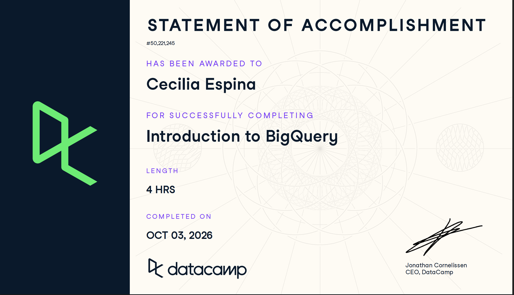

**Course:** IBM 6500  
**Instructor:** Dr. Jae Jung

# Course-Completion Evidence



I completed the *Introduction to BigQuery* course in the IBM 6500 DataCamp classroom on October 3rd, 2026.

## BigQuery Architecture and Structure

**Main ideas:** BigQuery is Google's cloud data warehouse. Data is organized as project → dataset → table, and queries run on Google's servers rather than my computer.

**BigQuery terminology or procedures:**

- **Project:** the top-level Google Cloud container that holds datasets and is responsible for billing.
- **Dataset:** a folder-like container inside a project that groups related tables.
- **Table:** where the data is stored, in rows and columns.
- **Schema:** the list of a table's column names and data types. I check it before writing a query.
- **Query editor:** the area in the BigQuery console where I write and run SQL.
- **Query result:** the output table that appears below the editor after a query runs.
- **Table naming:** a table is referenced as `project.dataset.table` inside backticks.

**Procedure for running a query:**

1. Open the BigQuery console and find the project and dataset in the Explorer panel.
2. Click a table and open its **Schema** tab to see the columns and data types.
3. Write the query in the query editor.
4. Check the estimate of data to be processed shown in the editor.
5. Click **Run** and review the query result.

**Important SQL syntax:**

```sql
SELECT column_name
FROM `project_name.dataset_name.table_name`;
```

- `project_name` is the Google Cloud project that holds and bills for the data.
- `dataset_name` is the folder-like container for related tables.
- `table_name` is the table being queried.

**Example:**

```sql
SELECT order_id, order_purchase_timestamp
FROM ecommerce.ecomm_order_details
LIMIT 10;
```

**Explanation:** This query reads two columns from the `ecomm_order_details` table in the `ecommerce` dataset and returns only the first 10 rows. `LIMIT` is a quick way to preview a table and check its structure before writing a bigger query.

**CEP application:** For the CEP, I could organize the farm store's data in one BigQuery project, with a separate dataset for each source (Clover sales and inventory, GA4 web analytics, and loyalty survey responses). Previewing each table first would show me which columns are available before I build dashboards or the RFM segmentation for the loyalty program.

## Writing Queries and Data Types

**Main ideas:** BigQuery columns have data types, such as dates and timestamps. Pulling out or filtering on parts of a timestamp is a common reporting task.

**BigQuery terminology or procedures:** `TIMESTAMP`, date parts (`YEAR`, `MONTH`), and `CURRENT_TIMESTAMP()`.

**Important SQL syntax:** `EXTRACT(part FROM column)`, `TIMESTAMP_SUB(timestamp, INTERVAL n DAY)`

**Example:**

```sql
SELECT COUNT(order_id) AS september_orders
FROM ecommerce.ecomm_order_details
WHERE EXTRACT(MONTH FROM order_purchase_timestamp) = 9;
```

**Explanation:** `EXTRACT(MONTH ...)` returns the month as a number from 1 to 12, so September is `9`. The query counts all orders placed in that month.

**Another example (orders older than 90 days):**

```sql
SELECT order_id, order_purchase_timestamp
FROM ecommerce.ecomm_order_details
WHERE order_purchase_timestamp <
      TIMESTAMP_SUB(CURRENT_TIMESTAMP(), INTERVAL 90 DAY);
```

**CEP application:** Monthly and rolling-window filters could summarize campaign results, GA4 sessions, or survey responses by period.

## Querying Data in BigQuery

**Main ideas:** BigQuery supports nested and repeated data (arrays and structs) and window functions. Window functions compare a row to related rows without collapsing the data.

**BigQuery terminology or procedures:** `ARRAY`, `STRUCT`, `UNNEST`, window, partition, ranking, `QUALIFY`.

**Important SQL syntax:** `UNNEST()`, `CROSS JOIN`, `RANK() OVER()`, `LAG()` and `LEAD()`, `ROWS BETWEEN ... AND ...`, `QUALIFY`

**Example 1: flatten an array and rank customers by spending**

```sql
WITH orders AS (
  SELECT od.customer_id, SUM(items.price) AS all_items
  FROM ecommerce.ecomm_orders o, UNNEST(o.order_items) items
  JOIN ecommerce.ecomm_order_details od USING (order_id)
  GROUP BY od.customer_id
)
SELECT customer_id, all_items,
       RANK() OVER (ORDER BY all_items DESC) AS spend_rank
FROM orders
ORDER BY all_items DESC;
```

`UNNEST` turns each item in the `order_items` array into its own row. `RANK()` then orders customers from highest to lowest spend.

**Example 2: previous and next values**

```sql
SELECT od.customer_id, items.price,
  LAG(items.price)  OVER (PARTITION BY od.customer_id
                          ORDER BY od.order_purchase_timestamp) AS previous_price,
  LEAD(items.price) OVER (PARTITION BY od.customer_id
                          ORDER BY od.order_purchase_timestamp) AS next_price
FROM ecommerce.ecomm_orders o, UNNEST(o.order_items) items
JOIN ecommerce.ecomm_order_details od USING (order_id);
```

`PARTITION BY` restarts the window for each customer. `LAG` looks at the previous row and `LEAD` at the next one.

**Example 3: rolling average filtered with QUALIFY**

```sql
SELECT order_id, order_purchase_timestamp,
  AVG(item.price) OVER (
    ORDER BY order_purchase_timestamp
    ROWS BETWEEN 9 PRECEDING AND CURRENT ROW) AS rolling_avg
FROM ecommerce.ecomm_order_details od
JOIN ecommerce.ecomm_orders o USING (order_id),
     UNNEST(o.order_items) AS item
QUALIFY rolling_avg > 500
ORDER BY order_purchase_timestamp;
```

The window averages the current row and the 9 rows before it. `WHERE` cannot filter on a window result, so `QUALIFY` is used instead.

**CEP application:** Rolling averages and previous/next comparisons could show trends in daily traffic, conversions, or ad spend. Ranking could identify top campaigns or customers.

## Data Management and Optimization

**Main ideas:** Join type decides which rows are kept. DML statements change data. Because BigQuery charges by data scanned, queries should read only what they need.

**BigQuery terminology or procedures:** `INNER`, `LEFT`, `RIGHT`, and `FULL OUTER` joins, DML (`INSERT`, `UPDATE`, `DELETE`, `MERGE`), partitions, clusters, approximate functions.

**Important SQL syntax:** `JOIN ... USING (col)`, `APPROX_COUNT_DISTINCT()`, selecting specific columns instead of `SELECT *`

**Example 1: joins**

```sql
SELECT COUNT(*) AS orders
FROM orders o
LEFT JOIN products p ON p.product_id = o.product_id;
```

A `LEFT JOIN` keeps every row from `orders`, matched or not. `RIGHT JOIN` keeps every row from `products`. `FULL OUTER JOIN` keeps both.

**Example 2: optimization**

```sql
SELECT p.payment_installments,
       APPROX_COUNT_DISTINCT(p.order_id) AS approx_orders,
       AVG(p.payment_value) / p.payment_installments AS avg_installment_value
FROM ecommerce.ecomm_payments p
JOIN ecommerce.ecomm_order_details o USING (order_id)
WHERE p.payment_installments > 0
GROUP BY p.payment_installments;
```

`APPROX_COUNT_DISTINCT` is faster and cheaper than `COUNT(DISTINCT ...)` and is accurate enough for many reports. Every selected column must be grouped or aggregated, which is why `payment_value` is wrapped in `AVG()`.

**Other takeaways:**

- `UPDATE` and `DELETE` require a `WHERE` clause in BigQuery.
- Partitioned and clustered tables improve DML performance.
- Batch changes into fewer statements rather than running many small ones.

**CEP application:** Left joins could combine campaign data with customer records without losing unmatched rows. Selecting only needed columns would keep query costs low on large marketing datasets.

# Overall Reflection and Future Reference

- **Most useful concepts or procedures:** Organizing data as project, dataset, and table, and filtering by date with `EXTRACT` and `TIMESTAMP_SUB`, were the most useful. I expect to use date filtering most, because marketing and sales questions are almost always about a time period, such as monthly sales, the last 90 days of orders, or results before and after a campaign, and these functions let me answer those questions directly.
- **How BigQuery differs from learning SQL syntax alone:** Learning SQL syntax is about writing correct queries. BigQuery adds the cloud environment around them: fully qualified table names in backticks, nested data like arrays that need `UNNEST`, and cost, since BigQuery charges by how much data a query scans. That is why selecting only the columns I need matters here. In plain SQL practice I just wrote queries against a table. In BigQuery I first had to understand where the data lives (project, dataset, table) and check its schema before I could write anything.
- **Most challenging concepts or procedures:**  `QUALIFY` was the most challenging because it looks like `WHERE` but filters on window function results, and I had to remember which clause to use for which kind of condition.
- **How BigQuery could support digital marketing analytics, customer insights, survey research, GA4 analysis, or my CEP:** BigQuery could bring Clover sales data, website analytics, and loyalty survey responses into one place. Window functions and ranking could show customer spending patterns for RFM segmentation, and date filters could summarize traffic or campaign results by period. Group access to GA4 is still pending, so GA4 analysis would be a later step.
- **Steps, terms, or query patterns I expect to review again:** - The `project.dataset.table` format and backticks, because it is easy to get wrong
- `UNNEST`, because nested data is the hardest structure to picture.
- `RANK() OVER` and `PARTITION BY`, for ranking and per-group calculations.
- `LAG` and `LEAD`, for comparing a row to the previous or next one.
- `QUALIFY`, to remember when to use it instead of `WHERE`.

# Appendix: Publication Links

- [GitHub Repository](https://github.com/YOUR-USERNAME/REPOSITORY-NAME)
- [Published Introduction to BigQuery Report](https://YOUR-USERNAME.github.io/REPOSITORY-NAME/introduction-to-bigquery.html)
